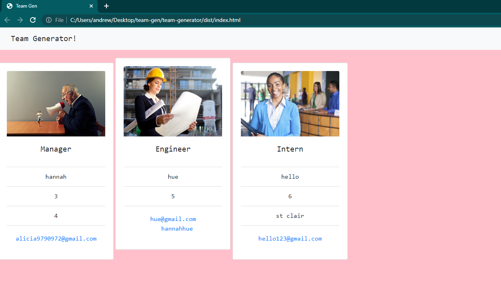

# Team Generator

## Description

The team generator is a simple program made to quickly form teams and input thier info. Its made to take stress of the managers plate and help put their efforts towards more important goals. My motivation was to se if i could implement a class and extentions of said class into a full functioning generator. I appriciate the experience i gained with testing, even tho i hate it, and the ability to deal with class/subclasses. this will assist any team lead with assigning roles and inputing info quickly and easily.

## Installation

No install required.

## Usage

open the terminal and enter node.js

answer the prompts and open your brand new HTML file!

Or follow this video demo!
watch link: https://watch.screencastify.com/v/QLEPpZ9FRCi3eOYxzsY6

watch the tests pass!
watch link: https://watch.screencastify.com/v/A0xNN8Z2Vg3QH5iiyg2L

## Credits

Hannahhue github: https://github.com/hannahhue

## License

MIT License

The MIT license gives users express permission to reuse code for any purpose, sometimes even if code is part of proprietary software. As long as users include the original copy of the MIT license in their distribution, they can make any changes or modifications to the code to suit their own needs.
